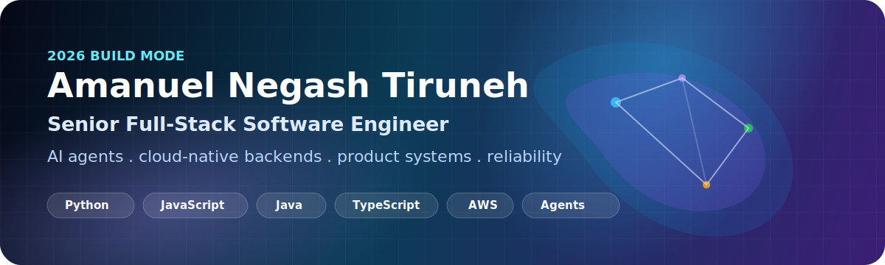
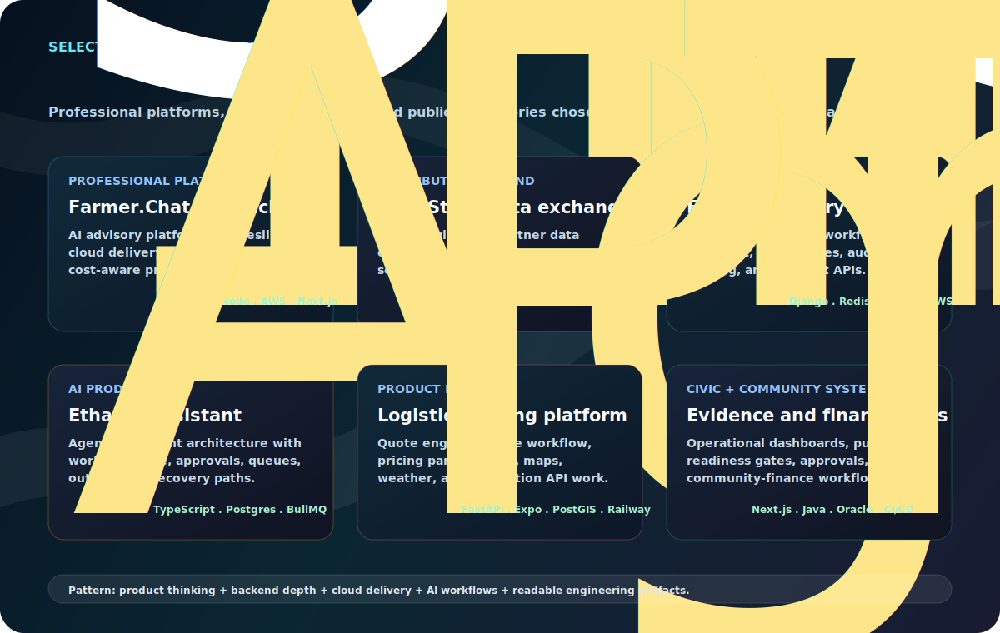
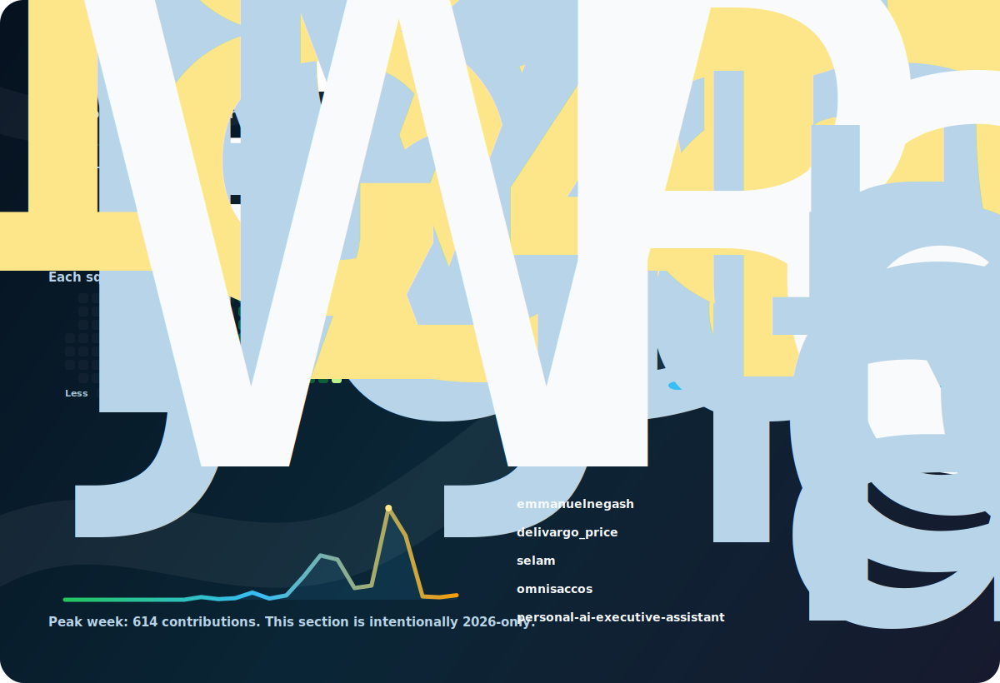

  

  
  
  

I am a **Full-Stack Software Engineer** building the kind of systems companies need now: AI-native product experiences, dependable backend platforms, secure cloud delivery, and interfaces that help people move through complex work with confidence.

My sweet spot is not one layer. It is the whole path from idea to production: understand the workflow, design the API, model the data, build the interface, connect the agent, add the queue, secure the boundary, observe the system, and keep improving it after launch.

## 2026 Focus

From **January 2026 forward**, I am shaping my public engineering work around one direction: useful AI products backed by reliable software.

I care about agents that are more than chat boxes. They should read the right context, call the right tools, pause for approval when the work is sensitive, and leave a clear trail for the user and the engineer. Around that, I care about the full product: clean interfaces, steady APIs, queues, data, tests, logs, and deployment.

  

## Roles I Am Built For

**Full-Stack Software Engineer**  
Own product features end to end: product UX, React/Next.js or mobile surfaces, backend APIs, data models, authentication, testing, deployment, and production follow-through.

**AI Product Engineer / Agentic AI Engineer**  
Build RAG, tool-calling agents, human-in-the-loop flows, memory, evaluations, tracing, model integration, and workflow automation around real business systems instead of demos that stop at chat.

**Backend / Platform Engineer**  
Design services, event-driven systems, queues, caching, database schemas, observability, CI/CD, rollback paths, and security boundaries that hold up under production pressure.

**Cloud-Native Software Engineer**  
Ship on AWS with containers, serverless, IAM/KMS, infrastructure as code, monitoring, cost awareness, and operational discipline.

## Responsibilities I Can Own

- Build AI-assisted workflows that connect models to tools, data, approval gates, and reliable product state.
- Design REST and event-driven backends with Django, FastAPI, Spring Boot, Express, Kafka, RabbitMQ, Redis, and PostgreSQL.
- Build full-stack product experiences with React, Next.js, TypeScript, Expo, React Native, Tailwind, charts, maps, forms, and role-aware flows.
- Own cloud delivery on AWS: ECS, EKS, Lambda, S3, RDS, DynamoDB, SQS, SNS, IAM, KMS, CloudWatch, API Gateway, Docker, Kubernetes, and Terraform.
- Improve production quality with automated tests, CI/CD, structured logging, Sentry, Prometheus, Grafana, audit logs, dependency scanning, and incident-ready observability.
- Turn messy domain workflows into simple product surfaces with clear language, trustworthy state, and measurable operational behavior.
- Work like a contributor: clear pull requests, readable commits, practical documentation, reviewable architecture decisions, and changes that are easy for a team to maintain.

## High-Demand Stack

**Core languages**

**Backend**

**Agentic AI**

**Data, search, and event systems**

**Frontend and mobile**

**Cloud, DevOps, and reliability**

## Professional Signal

My background includes production software work in agriculture, data exchange, registries, logistics, civic transparency, and community finance. The common thread is not the industry. The common thread is responsibility: systems with users, constraints, data, failure modes, and a need for engineering judgment.

I bring the depth expected from backend/platform roles and the range expected from full-stack roles. I can work close to the database, close to the user, and close to the deployment pipeline. That combination is where AI product engineering becomes real.

## Selected Project Portfolio

Selected work across AI product engineering, backend platforms, cloud reliability, data movement, mobile/product UX, and systems that need trust.

  

**Professional platforms**

- **Farmer.Chat / FarmchatAI**: AI advisory platform work at scale, with FastAPI, Node.js, Next.js analytics, AWS ECS/Lambda/S3/SQS, Terraform, GitHub Actions, reliability patterns, and cost-aware operations.
- **FarmStack data exchange**: distributed microservices for secure partner data exchange, using Java, Python, Node.js, OAuth2/JWT, Kafka, RabbitMQ, PostgreSQL, Cassandra, OpenSearch, Prometheus, Grafana, and Sentry.
- **Farmer Registry Platform**: offline-first registry workflows with Django, PostgreSQL, Redis, RabbitMQ/Celery, OpenSearch, pgvector, audit logs, role-aware access, Docker/Kubernetes, and AWS delivery.

**Product lab systems**

- **Etharon AI Executive Assistant**: agentic assistant architecture with workflow state, approval gates, Postgres/Drizzle, Redis/BullMQ queues, transactional outbox patterns, reconciliation workers, and mobile/admin surfaces.
- **Logistics Pricing Platform**: quote-engine and mobile workflow with FastAPI, Expo, React Native, PostGIS, Redis, production API readiness, pricing parity tests, maps, weather, and real deployment constraints.
- **Civic and community systems**: evidence dashboards, public-readiness gates, manager approval flows, community-finance workflows, Next.js/Java surfaces, Oracle Cloud deployment practice, CI/CD, and verification-heavy delivery.

## Contributor-Grade Delivery

Engineering delivery shaped for review, maintainability, and operations.

Readable pull requests, practical tests, clear ownership, direct communication, and production behavior that can be observed instead of guessed.

## GitHub Activity

As of **June 7, 2026**: **2,121 contributions in 2026** across public profile work, active repositories, and private engineering projects.

  

## Public Repositories

Representative public work:

- [PDFDB-Ask-RAG](https://github.com/emmanuelnegash/PDFDB-Ask-RAG): RAG over PDFs and database-backed knowledge.
- [ndtc-backend-submission](https://github.com/emmanuelnegash/ndtc-backend-submission): TypeScript full-stack campaign tracker with Next.js, Express, REST APIs, and SQLite.
- [Longest-Substring-Visualization](https://github.com/emmanuelnegash/Longest-Substring-Visualization): visual algorithm reasoning.
- [EQUB](https://github.com/emmanuelnegash/EQUB): community-finance product thinking.

## Current Direction

AI-heavy products with real product depth: agents that use tools, systems that remember state, dashboards that reveal truth, and backend platforms that make intelligence dependable.

I am open to full-stack software engineering, backend/platform, AI product engineering, cloud-native, and distributed-systems roles.

Reach me on [LinkedIn](https://www.linkedin.com/in/amanuel-negash-tiruneh/) or at [amanuel.ng@hotmail.com](mailto:amanuel.ng@hotmail.com).
