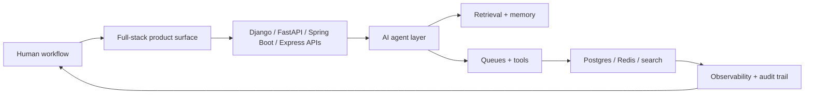

<p align="center">
  
</p>

<p align="center">
  <a href="https://git.io/typing-svg">
    
  </a>
</p>

<p align="center">
  <a href="https://www.linkedin.com/in/amanuel-negash-tiruneh/">
    
  </a>
  <a href="mailto:emmanuelvbc@gmail.com">
    
  </a>
  <a href="https://github.com/emmanuelnegash">
    
  </a>
</p>

I am a **Senior Full-Stack Software Engineer** who builds from both directions: polished product surfaces on the front, serious backend architecture underneath. My work sits where **AI agents, APIs, cloud systems, data, and human workflow** meet.

I like software that can explain itself: what happened, what state changed, what failed, what recovered, and what a person should trust next.

## 2026 Build Mode

Since **January 2026**, my engineering energy has been focused on a sharper direction:

```txt
AI agents that can act with context
retrieval systems that ground answers in real data
full-stack products that feel alive, not template-made
backend platforms that keep their promises under pressure
```

I am building around agentic AI, workflow automation, retrieval, approvals, durable state, and product interfaces that make complex work feel clear. The goal is not to sprinkle AI on top of an app. The goal is to wire intelligence into the system: permissions, memory, queues, search, audit logs, and user decisions.

## How I Think About Systems



Good systems have movement. A user takes action, the interface responds, the backend records truth, the agent reasons with context, the queue does the work, and observability keeps the whole thing honest.

## Agentic AI Direction

I am especially interested in AI systems that can:

- retrieve from private knowledge safely
- use tools with clear boundaries
- keep workflow state instead of pretending every prompt is new
- ask for approval before high-impact actions
- explain decisions through traces, events, and audit logs
- hand work back to a human when automation is not trustworthy

This is where my full-stack background helps. I can build the assistant surface, the API layer, the data model, the queue, the retrieval path, and the production checks around it.

## Product Lab

My personal builds are a product laboratory: AI assistants, logistics tools, civic transparency systems, diaspora community products, and finance/community workflows. They are not presented as employer projects. They are how I sharpen architecture, product taste, and execution.

The recurring pattern:

```txt
idea -> prototype -> backend truth -> interface polish -> reliability pass -> production path
```

Recent themes include AI executive assistance, quote/pricing workflows, public-accountability ledgers, trusted community graphs, and multi-tenant financial operations.

## Professional Foundation

Before this 2026 focus, I built and operated production systems in serious environments, including previous work at **Digital Green**. That foundation gave me the muscle for what I build now:

- Java and Python services in distributed environments
- AWS infrastructure, CI/CD, observability, and secure delivery
- large-scale agricultural and partner data platforms
- AI/RAG integrations connected to real product workflows
- mentoring, design review, testing strategy, and production troubleshooting

That experience matters because modern AI products still need old-fashioned discipline: clean APIs, durable data, security boundaries, tests, logs, rollback plans, and calm incident response.

## Visual Stack

**Core languages**


**Backend**


**AI agents and retrieval**


**Frontend and mobile**


**Cloud, data, and reliability**


## GitHub Motion

<p align="center">
  
</p>

<p align="center">
  
</p>

<p align="center">
  
</p>

## Public Edge

Some of my strongest work is private or still being shaped in product-lab repositories. The public edge shows pieces of the larger pattern:

- [PDFDB-Ask-RAG](https://github.com/emmanuelnegash/PDFDB-Ask-RAG): retrieval over documents and database-backed knowledge
- [ndtc-backend-submission](https://github.com/emmanuelnegash/ndtc-backend-submission): TypeScript full-stack campaign tracker
- [Longest-Substring-Visualization](https://github.com/emmanuelnegash/Longest-Substring-Visualization): visual algorithm reasoning
- [EQUB](https://github.com/emmanuelnegash/EQUB): community finance product thinking

## What I Want To Build Next

I want to keep building AI-heavy products where the work is real: agents that use tools, systems that remember state, dashboards that reveal truth, and backend platforms that make the intelligence dependable.

I am open to senior full-stack, backend/platform, AI product engineering, cloud-native, and distributed-systems roles.

Reach me on [LinkedIn](https://www.linkedin.com/in/amanuel-negash-tiruneh/) or at [emmanuelvbc@gmail.com](mailto:emmanuelvbc@gmail.com).
